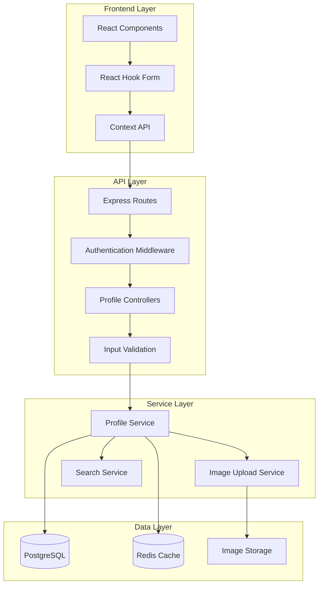

# Design Document: Simplified Profile Management System

## Overview

The Simplified Profile Management System provides essential profile management functionality for a freelance marketplace platform. This system focuses on core profile operations including CRUD functionality, image uploads, and role-specific features while maintaining simplicity and performance.

### Key Design Principles

- **Simplicity First**: Remove complex verification and certification workflows
- **Role-Based Design**: Separate concerns for freelancer and client profiles
- **Performance Optimized**: Efficient database queries and image handling
- **Security Focused**: Proper validation, sanitization, and authentication
- **Scalable Architecture**: Modular design supporting future enhancements

## Architecture

### System Architecture



### Technology Stack

- **Frontend**: Next.js 14, React 18, React Hook Form, Tailwind CSS
- **Backend**: Node.js, Express.js, JWT Authentication
- **Database**: PostgreSQL with connection pooling
- **Image Storage**: Cloudinary (production) / Local storage (development)
- **Caching**: Redis for profile data caching
- **Validation**: Zod for schema validation

## Components and Interfaces

### Frontend Components

#### ProfilePage Component
```typescript
interface ProfilePageProps {
  userRole: 'FREELANCER' | 'CLIENT';
}

interface ProfileFormData {
  // Base fields
  fullName: string;
  phone?: string;
  location?: string;
  website?: string;
  
  // Freelancer-specific fields
  title?: string;
  bio?: string;
  skills?: string;
  hourlyRate?: number;
  
  // Client-specific fields
  companyName?: string;
  companySize?: string;
  industry?: string;
}
```

#### ImageUpload Component
```typescript
interface ImageUploadProps {
  currentImageUrl?: string;
  onImageUpload: (imageUrl: string) => void;
  maxSizeBytes: number;
  acceptedTypes: string[];
}
```

#### PortfolioManager Component (Freelancer only)
```typescript
interface PortfolioItem {
  id: string;
  title: string;
  description: string;
  projectType: string;
  imageUrls: string[];
  technologiesUsed: string[];
  projectUrl?: string;
  completionDate?: Date;
}
```

### Backend API Interfaces

#### Profile Controller
```typescript
interface ProfileController {
  getProfile(req: AuthenticatedRequest, res: Response): Promise<void>;
  updateProfile(req: AuthenticatedRequest, res: Response): Promise<void>;
  uploadProfileImage(req: AuthenticatedRequest, res: Response): Promise<void>;
}

interface AuthenticatedRequest extends Request {
  user: {
    id: string;
    email: string;
    role: 'FREELANCER' | 'CLIENT';
  };
}
```

#### Profile Service Interface
```typescript
interface ProfileService {
  getProfileByUserId(userId: string): Promise<ProfileData>;
  updateProfile(userId: string, data: ProfileUpdateData): Promise<ProfileData>;
  uploadImage(userId: string, file: Express.Multer.File): Promise<string>;
  searchFreelancers(query: SearchQuery): Promise<FreelancerProfile[]>;
}
```

### API Endpoints

#### Core Profile Endpoints
- `GET /api/profile` - Retrieve current user's profile
- `PUT /api/profile` - Update complete profile
- `PATCH /api/profile` - Partial profile update
- `POST /api/profile/image` - Upload profile image
- `DELETE /api/profile/image` - Remove profile image

#### Portfolio Endpoints (Freelancer only)
- `GET /api/portfolio` - Get portfolio items
- `POST /api/portfolio` - Create portfolio item
- `PUT /api/portfolio/:id` - Update portfolio item
- `DELETE /api/portfolio/:id` - Delete portfolio item
- `POST /api/portfolio/:id/images` - Upload portfolio images

#### Search Endpoints
- `GET /api/search/freelancers` - Search freelancers by skills/location

## Data Models

### Database Schema

#### Enhanced User Profile Tables
```sql
-- Base users table (existing)
users (
  id UUID PRIMARY KEY,
  email VARCHAR(255) UNIQUE NOT NULL,
  password_hash VARCHAR(255) NOT NULL,
  role VARCHAR(20) NOT NULL,
  full_name VARCHAR(255),
  avatar_url TEXT,
  is_active BOOLEAN DEFAULT TRUE,
  created_at TIMESTAMP DEFAULT CURRENT_TIMESTAMP,
  updated_at TIMESTAMP DEFAULT CURRENT_TIMESTAMP
);

-- Enhanced freelancer_profiles table
freelancer_profiles (
  id UUID PRIMARY KEY,
  user_id UUID REFERENCES users(id),
  title VARCHAR(255),
  bio TEXT,
  skills TEXT,
  hourly_rate DECIMAL(10,2),
  location VARCHAR(255),
  website VARCHAR(255),
  languages TEXT[],
  timezone VARCHAR(100),
  profile_completion_percentage INTEGER DEFAULT 0,
  total_earnings DECIMAL(12,2) DEFAULT 0,
  total_jobs_completed INTEGER DEFAULT 0,
  average_rating DECIMAL(3,2) DEFAULT 0,
  response_time_hours INTEGER DEFAULT 24,
  is_featured BOOLEAN DEFAULT FALSE,
  created_at TIMESTAMP DEFAULT CURRENT_TIMESTAMP,
  updated_at TIMESTAMP DEFAULT CURRENT_TIMESTAMP
);

-- Enhanced client_profiles table
client_profiles (
  id UUID PRIMARY KEY,
  user_id UUID REFERENCES users(id),
  company_name VARCHAR(255),
  company_size VARCHAR(50),
  industry VARCHAR(100),
  company_description TEXT,
  location VARCHAR(255),
  founded_year INTEGER,
  employee_count INTEGER,
  annual_revenue VARCHAR(50),
  company_logo_url TEXT,
  linkedin_url VARCHAR(255),
  twitter_url VARCHAR(255),
  facebook_url VARCHAR(255),
  total_projects_posted INTEGER DEFAULT 0,
  total_amount_spent DECIMAL(12,2) DEFAULT 0,
  average_rating DECIMAL(3,2) DEFAULT 0,
  preferred_communication VARCHAR(50) DEFAULT 'email',
  created_at TIMESTAMP DEFAULT CURRENT_TIMESTAMP,
  updated_at TIMESTAMP DEFAULT CURRENT_TIMESTAMP
);
```

#### Portfolio and Skills Tables
```sql
-- Portfolio items for freelancers
portfolio_items (
  id UUID PRIMARY KEY,
  freelancer_id UUID REFERENCES freelancer_profiles(id),
  title VARCHAR(255) NOT NULL,
  description TEXT,
  project_type VARCHAR(50) NOT NULL,
  project_url VARCHAR(500),
  image_urls TEXT[],
  technologies_used TEXT[],
  client_name VARCHAR(255),
  project_duration_months INTEGER,
  budget_range VARCHAR(50),
  completion_date DATE,
  is_featured BOOLEAN DEFAULT FALSE,
  display_order INTEGER DEFAULT 0,
  created_at TIMESTAMP DEFAULT CURRENT_TIMESTAMP,
  updated_at TIMESTAMP DEFAULT CURRENT_TIMESTAMP
);

-- Detailed skills for freelancers
freelancer_skills (
  id UUID PRIMARY KEY,
  freelancer_id UUID REFERENCES freelancer_profiles(id),
  skill_name VARCHAR(100) NOT NULL,
  proficiency_level INTEGER CHECK (proficiency_level >= 1 AND proficiency_level <= 5),
  years_experience INTEGER DEFAULT 0,
  is_primary BOOLEAN DEFAULT FALSE,
  created_at TIMESTAMP DEFAULT CURRENT_TIMESTAMP
);
```

### Data Transfer Objects

#### Profile Response DTO
```typescript
interface ProfileResponseDTO {
  id: string;
  email: string;
  fullName: string;
  avatarUrl?: string;
  role: 'FREELANCER' | 'CLIENT';
  phone?: string;
  location?: string;
  website?: string;
  
  // Role-specific data
  freelancerProfile?: FreelancerProfileDTO;
  clientProfile?: ClientProfileDTO;
}

interface FreelancerProfileDTO {
  title?: string;
  bio?: string;
  skills?: string;
  hourlyRate?: number;
  profileCompletionPercentage: number;
  totalEarnings: number;
  totalJobsCompleted: number;
  averageRating: number;
  responseTimeHours: number;
  isFeatured: boolean;
}

interface ClientProfileDTO {
  companyName?: string;
  companySize?: string;
  industry?: string;
  companyDescription?: string;
  totalProjectsPosted: number;
  totalAmountSpent: number;
  averageRating: number;
  preferredCommunication: string;
}
```

## Correctness Properties

*A property is a characteristic or behavior that should hold true across all valid executions of a system-essentially, a formal statement about what the system should do. Properties serve as the bridge between human-readable specifications and machine-verifiable correctness guarantees.*

### Property 1: Profile Retrieval Performance

*For any* authenticated user, requesting their profile should return complete profile data within 200ms.

**Validates: Requirements 2.1**

### Property 2: Profile Update Performance

*For any* valid profile update data, the API should validate and save changes within 500ms.

**Validates: Requirements 2.2**

### Property 3: Invalid Data Error Handling

*For any* invalid profile data submission, the API should return descriptive validation errors with appropriate HTTP status codes.

**Validates: Requirements 2.3**

### Property 4: Partial Update Support

*For any* subset of profile fields, PATCH operations should successfully update only the specified fields while preserving other existing data.

**Validates: Requirements 2.4**

### Property 5: Profile Data Consistency

*For any* profile operation (create, update, delete), data consistency should be maintained across all related tables (users, freelancer_profiles, client_profiles, portfolio_items).

**Validates: Requirements 2.5**

### Property 6: Image Upload Success

*For any* valid image file (JPEG, PNG, WebP under 5MB), the image service should store it securely and return a valid URL.

**Validates: Requirements 3.1**

### Property 7: Image Upload Error Handling

*For any* failed image upload (invalid type, oversized, network error), the system should return a descriptive error message.

**Validates: Requirements 3.2**

### Property 8: Image File Type Validation

*For any* uploaded file, only JPEG, PNG, and WebP file types should be accepted, and all other types should be rejected with appropriate error messages.

**Validates: Requirements 3.3**

### Property 9: Image Size Validation

*For any* uploaded image file, files exceeding 5MB should be rejected with appropriate error messages.

**Validates: Requirements 3.4**

### Property 10: Avatar URL Update

*For any* successful profile image upload, the user's avatar_url field should be updated with the new image URL.

**Validates: Requirements 3.5**

### Property 11: Required Field Validation

*For any* profile data submission, all required fields should be validated and missing required fields should result in validation errors.

**Validates: Requirements 4.1**

### Property 12: Skills Format Validation

*For any* skills input, the system should validate format and length constraints, rejecting invalid formats or overly long skill lists.

**Validates: Requirements 4.2**

### Property 13: Hourly Rate Validation

*For any* hourly rate input, only positive decimal numbers should be accepted, and invalid numeric formats should be rejected.

**Validates: Requirements 4.3**

### Property 14: Bio Length Validation

*For any* bio text input, the system should enforce a maximum length of 500 characters and reject longer inputs.

**Validates: Requirements 4.4**

### Property 15: XSS Prevention

*For any* text input containing potential XSS payloads, the system should sanitize the input to prevent script execution.

**Validates: Requirements 4.5**

### Property 16: Skills CRUD Operations

*For any* freelancer profile, skills should support complete CRUD operations (add, read, update, delete) while maintaining data integrity.

**Validates: Requirements 5.1**

### Property 17: Freelancer Profile Fields

*For any* freelancer profile, professional title, bio, and hourly rate fields should be stored and retrieved correctly with proper validation.

**Validates: Requirements 5.2, 5.3**

### Property 18: Availability Status Management

*For any* freelancer profile, availability status should be toggleable and the state should be properly maintained across sessions.

**Validates: Requirements 5.4**

### Property 19: Portfolio Item Creation

*For any* valid portfolio item data, the system should store title, description, images, and all project details correctly.

**Validates: Requirements 5.5, 6.1**

### Property 20: Portfolio Update Integrity

*For any* portfolio item update, existing data integrity should be preserved and only specified fields should be modified.

**Validates: Requirements 6.2**

### Property 21: Portfolio Deletion Cleanup

*For any* portfolio item deletion, all associated images should be removed from storage and database references should be cleaned up.

**Validates: Requirements 6.3**

### Property 22: Multiple Image Support

*For any* portfolio item, multiple images should be supported with proper storage and retrieval of all uploaded images.

**Validates: Requirements 6.4**

### Property 23: Portfolio Display Order

*For any* portfolio reordering operation, the display order should be maintained consistently across all views and sessions.

**Validates: Requirements 6.5**

### Property 24: Client Profile Fields

*For any* client profile, company name, description, and industry fields should be stored and retrieved correctly with proper validation.

**Validates: Requirements 7.1, 7.3**

### Property 25: Company Size Validation

*For any* company size input, only predefined options should be accepted and invalid options should be rejected.

**Validates: Requirements 7.2**

### Property 26: Company Website Validation

*For any* company website URL input, proper URL format validation should be enforced and invalid URLs should be rejected.

**Validates: Requirements 7.4**

### Property 27: Company Information Validation

*For any* company information submission, all format and constraint validations should be applied consistently.

**Validates: Requirements 7.5**

### Property 28: Search Performance

*For any* search query, matching freelancer profiles should be returned within 1 second.

**Validates: Requirements 8.1**

### Property 29: Partial Text Search

*For any* search term, the system should support partial text matching across skills and location fields.

**Validates: Requirements 8.2, 8.3**

### Property 30: Combined Search Filters

*For any* combination of skill and location search filters, the system should return results matching all specified criteria.

**Validates: Requirements 8.4**

### Property 31: Search Result Ordering

*For any* search query, results should be ordered by relevance score in a consistent and deterministic manner.

**Validates: Requirements 8.5**

### Property 32: Profile Retrieval API

*For any* authenticated user, the GET /api/profile endpoint should return their complete profile data in the correct JSON format.

**Validates: Requirements 9.1**

### Property 33: Complete Profile Update API

*For any* complete profile data, the PUT /api/profile endpoint should update all fields and return the updated profile.

**Validates: Requirements 9.2**

### Property 34: Partial Profile Update API

*For any* partial profile data, the PATCH /api/profile endpoint should update only specified fields and preserve others.

**Validates: Requirements 9.3**

### Property 35: Image Upload API

*For any* valid image file, the POST /api/profile/image endpoint should handle the upload and return the image URL.

**Validates: Requirements 9.4**

### Property 36: API Response Consistency

*For any* API request, responses should follow consistent JSON format with appropriate HTTP status codes and error structures.

**Validates: Requirements 9.5**

### Property 37: Session Integrity

*For any* authenticated user session, authentication and session data integrity should be maintained across all profile operations.

**Validates: Requirements 10.4**

## Error Handling

### Error Categories

#### Validation Errors
- **Field Validation**: Required fields, format validation, length constraints
- **Type Validation**: File type validation for images, numeric validation for rates
- **Business Logic**: Role-specific field validation, skill format validation

#### Authentication Errors
- **Unauthorized Access**: Missing or invalid JWT tokens
- **Forbidden Operations**: Role-based access control violations
- **Session Expiry**: Expired authentication tokens

#### System Errors
- **Database Errors**: Connection failures, constraint violations, query timeouts
- **External Service Errors**: Image upload service failures, network timeouts
- **Resource Errors**: File size limits, storage quota exceeded

### Error Response Format

```typescript
interface ErrorResponse {
  success: false;
  error: {
    code: string;
    message: string;
    details?: Record<string, string[]>; // Field-specific validation errors
    timestamp: string;
    requestId: string;
  };
}
```

### Error Handling Strategies

#### Frontend Error Handling
- **Form Validation**: Real-time validation with user-friendly messages
- **Network Errors**: Retry mechanisms with exponential backoff
- **User Feedback**: Toast notifications and inline error displays
- **Graceful Degradation**: Fallback UI states for service unavailability

#### Backend Error Handling
- **Input Sanitization**: Prevent XSS and injection attacks
- **Rate Limiting**: Prevent abuse and DoS attacks
- **Error Logging**: Comprehensive logging for debugging and monitoring
- **Circuit Breakers**: Prevent cascade failures in external service calls

## Testing Strategy

### Dual Testing Approach

The testing strategy employs both unit testing and property-based testing to ensure comprehensive coverage:

- **Unit Tests**: Verify specific examples, edge cases, and error conditions
- **Property Tests**: Verify universal properties across all inputs
- **Integration Tests**: Test complete workflows and API interactions
- **End-to-End Tests**: Validate user journeys and system behavior

### Property-Based Testing Configuration

**Testing Framework**: Fast-check (JavaScript/TypeScript property-based testing library)

**Configuration Requirements**:
- Minimum 100 iterations per property test
- Each property test must reference its design document property
- Tag format: **Feature: simplified-profile-management, Property {number}: {property_text}**

**Example Property Test Structure**:
```typescript
import fc from 'fast-check';

describe('Profile Management Properties', () => {
  it('Property 1: Profile Retrieval Performance', async () => {
    // Feature: simplified-profile-management, Property 1: Profile retrieval performance
    await fc.assert(
      fc.asyncProperty(
        fc.record({
          userId: fc.uuid(),
          role: fc.constantFrom('FREELANCER', 'CLIENT')
        }),
        async (user) => {
          const startTime = Date.now();
          const profile = await profileService.getProfile(user.userId);
          const endTime = Date.now();
          
          expect(endTime - startTime).toBeLessThan(200);
          expect(profile).toBeDefined();
          expect(profile.id).toBe(user.userId);
        }
      ),
      { numRuns: 100 }
    );
  });
});
```

### Unit Testing Focus Areas

**Specific Examples**:
- Profile creation with valid data
- Image upload with standard file formats
- Search with common skill terms

**Edge Cases**:
- Empty profile data submissions
- Maximum file size boundary testing
- Special characters in text fields
- Network timeout scenarios

**Error Conditions**:
- Invalid authentication tokens
- Database connection failures
- External service unavailability
- Malformed request payloads

### Integration Testing

**API Integration**:
- Complete profile management workflows
- Image upload and retrieval flows
- Search functionality with database queries
- Authentication and authorization flows

**Database Integration**:
- Transaction rollback scenarios
- Concurrent update handling
- Foreign key constraint validation
- Data migration verification

### Performance Testing

**Load Testing**:
- Profile retrieval under concurrent load
- Image upload performance with multiple files
- Search performance with large datasets
- Database query optimization validation

**Stress Testing**:
- System behavior under resource constraints
- Memory usage during large file uploads
- Database connection pool exhaustion
- Rate limiting effectiveness

### Security Testing

**Input Validation**:
- XSS payload injection attempts
- SQL injection prevention
- File upload security (malicious files)
- Authentication bypass attempts

**Authorization Testing**:
- Role-based access control validation
- Cross-user data access prevention
- API endpoint security verification
- Session management security