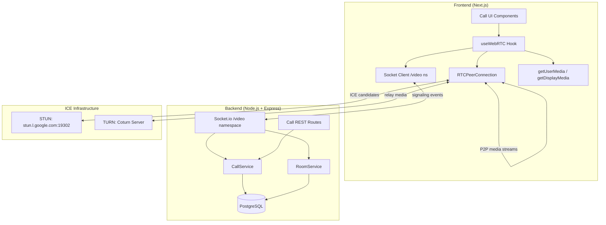
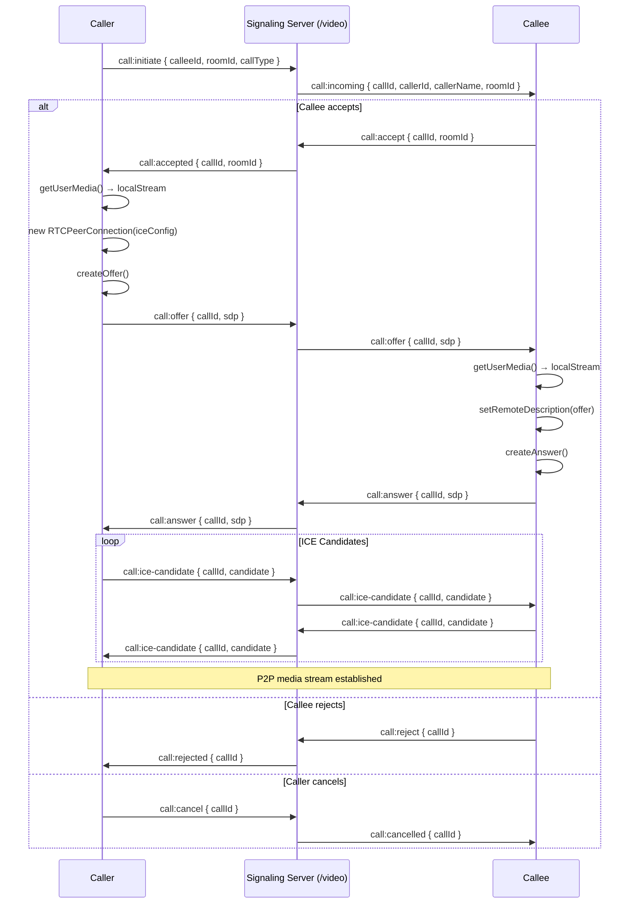
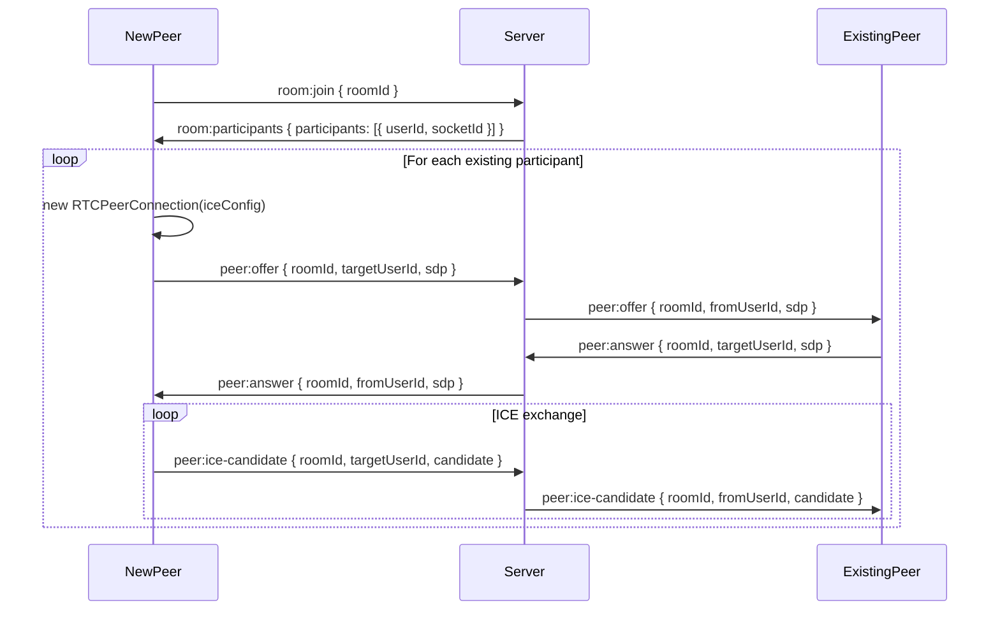

# Design Document: WebRTC Video Calls

## Overview

This feature adds real-time video calling to FreelanceHub, enabling 1-to-1 and small group (2-4 person) video calls between clients and freelancers. It is built on WebRTC for peer-to-peer media transport, with Socket.io handling signaling via a dedicated `/video` namespace that reuses the existing Socket.io server. The system covers call initiation, media controls, screen sharing, group mesh calls, push notifications, and scheduled meetings.

The architecture follows a standard WebRTC signaling pattern: the server never touches media streams — it only relays SDP offers/answers and ICE candidates between peers. STUN (Google's public server) handles NAT traversal for most users; a Coturn TURN server is available as a relay fallback. All call metadata is persisted in PostgreSQL using new `calls`, `call_participants`, `call_logs`, and `scheduled_calls` tables.

The feature is delivered in four phases: (1) infrastructure & DB, (2) 1-to-1 MVP, (3) call controls & screen sharing, (4) group mesh calls, plus a notifications/scheduling phase.

---

## Architecture




---

## Sequence Diagrams

### 1-to-1 Call Flow



### Group Call Join Flow



---

## Components and Interfaces

### Backend: VideoSignalingHandler

**Purpose**: Socket.io `/video` namespace handler — relays all WebRTC signaling events and manages call/room state.

**Interface** (JavaScript):
```javascript
// backend/src/socket/videoSignalingHandler.js
const initVideoSignaling = (io) => {
  const videoNs = io.of('/video')
  videoNs.use(jwtSocketMiddleware)
  videoNs.on('connection', (socket) => { /* ... */ })
}
```

**Responsibilities**:
- Authenticate socket connections via JWT (reuse existing middleware pattern)
- Relay `call:offer`, `call:answer`, `call:ice-candidate` to target peers
- Manage call lifecycle state transitions in DB via CallService
- Manage room membership for group calls via RoomService
- Emit `call:incoming` push notifications to offline users

### Backend: CallService

**Purpose**: Business logic for 1-to-1 call lifecycle and persistence.

**Interface**:
```javascript
// backend/src/services/callService.js
const callService = {
  initiateCall: async (callerId, calleeId, callType) => Call,
  acceptCall:   async (callId, userId) => Call,
  rejectCall:   async (callId, userId) => Call,
  endCall:      async (callId, userId) => Call,
  getCall:      async (callId) => Call,
  getCallHistory: async (userId, limit, offset) => Call[],
}
```

### Backend: RoomService

**Purpose**: Group call room management.

**Interface**:
```javascript
// backend/src/services/roomService.js
const roomService = {
  createRoom:   async (hostId, roomName, maxParticipants) => Room,
  joinRoom:     async (roomId, userId) => { room, participants },
  leaveRoom:    async (roomId, userId) => void,
  getRoom:      async (roomId) => Room,
  getRoomParticipants: async (roomId) => Participant[],
  muteParticipant: async (roomId, hostId, targetUserId) => void,
  removeParticipant: async (roomId, hostId, targetUserId) => void,
}
```

### Backend: ScheduledCallService

**Purpose**: Meeting scheduling, calendar invites, shareable URLs.

**Interface**:
```javascript
const scheduledCallService = {
  scheduleCall:    async (hostId, participantIds, scheduledAt, title) => ScheduledCall,
  getScheduled:    async (userId) => ScheduledCall[],
  joinByMeetingId: async (meetingId, userId) => { roomId, token },
  cancelScheduled: async (meetingId, userId) => void,
}
```

### Frontend: useWebRTC Hook

**Purpose**: Encapsulates all WebRTC peer connection logic, media stream management, and signaling socket events.

**Interface**:
```typescript
// frontend/hooks/useWebRTC.ts
interface UseWebRTCReturn {
  localStream: MediaStream | null
  remoteStreams: Map<string, MediaStream>
  callState: CallState
  isAudioMuted: boolean
  isVideoOff: boolean
  isScreenSharing: boolean
  initiateCall: (calleeId: string, callType: 'video' | 'audio') => Promise<void>
  acceptCall: (callId: string) => Promise<void>
  rejectCall: (callId: string) => void
  endCall: () => void
  toggleAudio: () => void
  toggleVideo: () => void
  startScreenShare: () => Promise<void>
  stopScreenShare: () => void
  switchDevice: (deviceId: string, kind: 'audioinput' | 'videoinput') => Promise<void>
}

type CallState = 'idle' | 'calling' | 'ringing' | 'connected' | 'ended' | 'failed'
```

### Frontend: CallNotificationManager

**Purpose**: Handles incoming call UI (ringtone, browser push notifications, missed call badges).

**Interface**:
```typescript
interface CallNotificationManager {
  showIncomingCall: (callInfo: IncomingCallInfo) => void
  dismissIncomingCall: () => void
  requestPushPermission: () => Promise<NotificationPermission>
  showMissedCallNotification: (callerName: string) => void
}
```

---

## Data Models

### calls table

```sql
CREATE TABLE calls (
  call_id       UUID PRIMARY KEY DEFAULT gen_random_uuid(),
  caller_id     UUID NOT NULL REFERENCES users(id) ON DELETE CASCADE,
  receiver_id   UUID REFERENCES users(id) ON DELETE SET NULL,
  room_id       UUID REFERENCES call_rooms(room_id) ON DELETE SET NULL,
  status        VARCHAR(20) NOT NULL DEFAULT 'initiated',
  -- status: initiated | ringing | connected | ended | rejected | cancelled | failed | missed
  call_type     VARCHAR(10) NOT NULL DEFAULT 'video', -- video | audio
  start_time    TIMESTAMP,
  end_time      TIMESTAMP,
  duration      INTEGER, -- seconds
  created_at    TIMESTAMP DEFAULT CURRENT_TIMESTAMP,
  updated_at    TIMESTAMP DEFAULT CURRENT_TIMESTAMP
);
```

### call_rooms table

```sql
CREATE TABLE call_rooms (
  room_id         UUID PRIMARY KEY DEFAULT gen_random_uuid(),
  host_id         UUID NOT NULL REFERENCES users(id) ON DELETE CASCADE,
  room_name       VARCHAR(255),
  max_participants INTEGER DEFAULT 4,
  status          VARCHAR(20) DEFAULT 'active', -- active | ended
  created_at      TIMESTAMP DEFAULT CURRENT_TIMESTAMP,
  ended_at        TIMESTAMP
);
```

### call_participants table

```sql
CREATE TABLE call_participants (
  id            UUID PRIMARY KEY DEFAULT gen_random_uuid(),
  call_id       UUID REFERENCES calls(call_id) ON DELETE CASCADE,
  room_id       UUID REFERENCES call_rooms(room_id) ON DELETE CASCADE,
  user_id       UUID NOT NULL REFERENCES users(id) ON DELETE CASCADE,
  joined_at     TIMESTAMP DEFAULT CURRENT_TIMESTAMP,
  left_at       TIMESTAMP,
  is_muted      BOOLEAN DEFAULT FALSE,
  is_video_off  BOOLEAN DEFAULT FALSE
);
```

### call_logs table

```sql
CREATE TABLE call_logs (
  id          UUID PRIMARY KEY DEFAULT gen_random_uuid(),
  call_id     UUID REFERENCES calls(call_id) ON DELETE CASCADE,
  user_id     UUID NOT NULL REFERENCES users(id) ON DELETE CASCADE,
  event       VARCHAR(50) NOT NULL, -- initiated, accepted, rejected, ended, failed, ice_failed
  metadata    JSONB,
  created_at  TIMESTAMP DEFAULT CURRENT_TIMESTAMP
);
```

### scheduled_calls table

```sql
CREATE TABLE scheduled_calls (
  meeting_id    UUID PRIMARY KEY DEFAULT gen_random_uuid(),
  host_id       UUID NOT NULL REFERENCES users(id) ON DELETE CASCADE,
  title         VARCHAR(255) NOT NULL,
  scheduled_at  TIMESTAMP NOT NULL,
  duration_mins INTEGER DEFAULT 60,
  meeting_url   TEXT UNIQUE NOT NULL, -- /calls/join/:meeting_id
  status        VARCHAR(20) DEFAULT 'scheduled', -- scheduled | started | completed | cancelled
  created_at    TIMESTAMP DEFAULT CURRENT_TIMESTAMP
);

CREATE TABLE scheduled_call_participants (
  id          UUID PRIMARY KEY DEFAULT gen_random_uuid(),
  meeting_id  UUID NOT NULL REFERENCES scheduled_calls(meeting_id) ON DELETE CASCADE,
  user_id     UUID NOT NULL REFERENCES users(id) ON DELETE CASCADE,
  UNIQUE(meeting_id, user_id)
);
```

**Validation Rules**:
- `calls.status` must be one of the defined enum values
- `call_rooms.max_participants` must be between 2 and 4 (mesh topology limit)
- `scheduled_calls.scheduled_at` must be in the future at creation time
- `calls.duration` is computed as `EXTRACT(EPOCH FROM (end_time - start_time))`

---

## Algorithmic Pseudocode

### RTCPeerConnection Setup Algorithm

```javascript
// Preconditions:
//   - iceConfig contains at least one STUN server
//   - localStream has been acquired via getUserMedia()
// Postconditions:
//   - peerConnection is ready to create offer/answer
//   - onicecandidate fires and emits candidates to signaling server
//   - ontrack fires and adds remote stream to remoteStreams map

function createPeerConnection(targetUserId, iceConfig, socket, callId) {
  const pc = new RTCPeerConnection(iceConfig)

  // Add local tracks
  localStream.getTracks().forEach(track => pc.addTrack(track, localStream))

  // ICE candidate relay
  pc.onicecandidate = ({ candidate }) => {
    if (candidate) {
      socket.emit('call:ice-candidate', { callId, targetUserId, candidate })
    }
  }

  // Remote stream handling
  pc.ontrack = ({ streams }) => {
    remoteStreams.set(targetUserId, streams[0])
    updateUI()
  }

  // Connection state monitoring
  pc.onconnectionstatechange = () => {
    if (pc.connectionState === 'failed') {
      setCallState('failed')
      attemptIceRestart(pc, callId, socket)
    }
    if (pc.connectionState === 'connected') {
      setCallState('connected')
    }
  }

  return pc
}
```

**Preconditions**: `localStream` is non-null; `iceConfig.iceServers` is non-empty array  
**Postconditions**: Returns configured `RTCPeerConnection`; ICE and track handlers registered  
**Loop Invariant**: Each track in `localStream.getTracks()` is added exactly once

### Call State Machine

```javascript
// Valid transitions:
//   idle       → calling   (initiateCall)
//   idle       → ringing   (incomingCall)
//   calling    → ringing   (call:incoming ack)
//   ringing    → connected (call:accepted + ICE complete)
//   ringing    → idle      (call:rejected | call:cancelled)
//   calling    → idle      (call:cancel)
//   connected  → ended     (call:end)
//   *          → failed    (ICE failure | network error)

function transition(currentState, event) {
  const transitions = {
    idle:      { initiateCall: 'calling',   incomingCall: 'ringing' },
    calling:   { callAccepted: 'connected', callRejected: 'idle', cancel: 'idle' },
    ringing:   { accept: 'connected',       reject: 'idle',       cancelled: 'idle' },
    connected: { end: 'ended' },
  }
  const next = transitions[currentState]?.[event]
  if (!next) throw new Error(`Invalid transition: ${currentState} + ${event}`)
  return next
}
```

### Group Mesh Connection Algorithm

```javascript
// Preconditions:
//   - User has joined room (room:join acknowledged)
//   - participants[] contains all existing peer userIds
// Postconditions:
//   - One RTCPeerConnection exists per existing participant
//   - All connections are in 'connecting' or 'connected' state
// Loop Invariant:
//   - peerConnections.size === number of processed participants so far

async function connectToAllPeers(participants, roomId, socket) {
  for (const { userId } of participants) {
    // ASSERT: peerConnections does not yet contain userId
    const pc = createPeerConnection(userId, iceConfig, socket, null)
    peerConnections.set(userId, pc)

    const offer = await pc.createOffer()
    await pc.setLocalDescription(offer)
    socket.emit('peer:offer', { roomId, targetUserId: userId, sdp: offer })
    // ASSERT: peerConnections.size incremented by 1
  }
  // ASSERT: peerConnections.size === participants.length
}
```

### Media Toggle Algorithm

```javascript
// Preconditions: localStream is active, peerConnections is non-empty
// Postconditions: all senders updated; remote peers notified via socket

function toggleAudio(localStream, peerConnections, socket, callId) {
  const audioTrack = localStream.getAudioTracks()[0]
  if (!audioTrack) return

  audioTrack.enabled = !audioTrack.enabled
  const muted = !audioTrack.enabled

  // Notify remote peers (informational — they can still receive the silent track)
  socket.emit('media:toggle-audio', { callId, muted })
  return muted
}

function toggleVideo(localStream, peerConnections, socket, callId) {
  const videoTrack = localStream.getVideoTracks()[0]
  if (!videoTrack) return

  videoTrack.enabled = !videoTrack.enabled
  const videoOff = !videoTrack.enabled
  socket.emit('media:toggle-video', { callId, videoOff })
  return videoOff
}
```

### Screen Share Algorithm

```javascript
// Preconditions: call is in 'connected' state
// Postconditions: video sender replaced with screen track; reverts on stream end

async function startScreenShare(peerConnections, socket, callId) {
  const screenStream = await navigator.mediaDevices.getDisplayMedia({ video: true })
  const screenTrack = screenStream.getVideoTracks()[0]

  // Replace video sender on all peer connections
  for (const [userId, pc] of peerConnections) {
    const sender = pc.getSenders().find(s => s.track?.kind === 'video')
    if (sender) await sender.replaceTrack(screenTrack)
  }

  // Auto-revert when user stops sharing via browser UI
  screenTrack.onended = () => stopScreenShare(peerConnections, localStream, socket, callId)

  socket.emit('media:screen-share-started', { callId })
  return screenStream
}
```

---

## Key Functions with Formal Specifications

### `initiateCall(calleeId, callType)`

```javascript
async function initiateCall(calleeId, callType = 'video')
```

**Preconditions**:
- `calleeId` is a valid UUID of an existing user
- `callState === 'idle'`
- User has granted camera/mic permissions (or mic-only for audio calls)

**Postconditions**:
- A `calls` row is created with `status = 'initiated'`
- `callState` transitions to `'calling'`
- `call:initiate` event emitted to signaling server
- Callee receives `call:incoming` event

**Error Cases**: Callee offline → server emits `call:unavailable`; permission denied → `callState` stays `'idle'`, error surfaced to UI

### `endCall(callId)`

```javascript
async function endCall(callId)
```

**Preconditions**:
- `callState` is `'connected'` or `'calling'` or `'ringing'`
- `callId` is valid

**Postconditions**:
- All `RTCPeerConnection` instances closed and removed from map
- All local media tracks stopped
- `calls` row updated: `status = 'ended'`, `end_time = NOW()`, `duration` computed
- `callState` transitions to `'ended'`
- Remote peers receive `call:end` event

### `POST /api/calls/initiate`

**Preconditions**: Authenticated user; `calleeId` in request body; callee exists  
**Postconditions**: Returns `{ callId, roomId, status: 'initiated' }`; DB row created  
**Error Responses**: 404 if callee not found; 409 if callee already in a call

### `POST /api/calls/:callId/end`

**Preconditions**: Authenticated user is caller or callee; call exists and is active  
**Postconditions**: Call record updated with end time and duration; returns updated call object

---

## Socket Events Reference

### 1-to-1 Signaling Events (`/video` namespace)

| Event | Direction | Payload |
|-------|-----------|---------|
| `call:initiate` | Client → Server | `{ calleeId, callType, roomId }` |
| `call:incoming` | Server → Client | `{ callId, callerId, callerName, callerAvatar, roomId, callType }` |
| `call:accept` | Client → Server | `{ callId }` |
| `call:accepted` | Server → Client | `{ callId }` |
| `call:reject` | Client → Server | `{ callId }` |
| `call:rejected` | Server → Client | `{ callId }` |
| `call:cancel` | Client → Server | `{ callId }` |
| `call:cancelled` | Server → Client | `{ callId }` |
| `call:offer` | Client → Server | `{ callId, sdp }` |
| `call:answer` | Client → Server | `{ callId, sdp }` |
| `call:ice-candidate` | Client → Server | `{ callId, candidate }` |
| `call:end` | Client → Server | `{ callId }` |
| `call:ended` | Server → Client | `{ callId }` |

### Media Control Events

| Event | Direction | Payload |
|-------|-----------|---------|
| `media:toggle-audio` | Client → Server → Peers | `{ callId, muted }` |
| `media:toggle-video` | Client → Server → Peers | `{ callId, videoOff }` |
| `media:screen-share-started` | Client → Server → Peers | `{ callId }` |
| `media:screen-share-stopped` | Client → Server → Peers | `{ callId }` |

### Group Room Events

| Event | Direction | Payload |
|-------|-----------|---------|
| `room:join` | Client → Server | `{ roomId }` |
| `room:participants` | Server → Client | `{ participants: [{ userId, socketId, name }] }` |
| `room:leave` | Client → Server | `{ roomId }` |
| `peer:offer` | Client → Server | `{ roomId, targetUserId, sdp }` |
| `peer:answer` | Client → Server | `{ roomId, targetUserId, sdp }` |
| `peer:ice-candidate` | Client → Server | `{ roomId, targetUserId, candidate }` |
| `peer:disconnect` | Server → Client | `{ userId }` |
| `host:mute-all` | Client → Server | `{ roomId }` |
| `host:remove-participant` | Client → Server | `{ roomId, targetUserId }` |

---

## REST API Endpoints

```
POST   /api/calls/initiate              → Create call record, return callId + roomId
POST   /api/calls/:callId/end           → End call, compute duration
GET    /api/calls/:callId               → Get call details
GET    /api/calls/history               → Paginated call history for user

POST   /api/rooms                       → Create group room
GET    /api/rooms/:roomId               → Get room info + participants
POST   /api/rooms/:roomId/join          → Join room
POST   /api/rooms/:roomId/leave         → Leave room

POST   /api/calls/schedule              → Schedule a meeting
GET    /api/calls/scheduled             → List upcoming scheduled calls
GET    /api/calls/join/:meetingId       → Resolve meeting URL → roomId
DELETE /api/calls/scheduled/:meetingId  → Cancel scheduled call
```

---

## ICE Configuration

```javascript
// frontend/lib/iceConfig.js
const ICE_CONFIG = {
  iceServers: [
    { urls: 'stun:stun.l.google.com:19302' },
    { urls: 'stun:stun1.l.google.com:19302' },
    {
      urls: process.env.NEXT_PUBLIC_TURN_URL,       // e.g. turn:your-coturn-server:3478
      username: process.env.NEXT_PUBLIC_TURN_USER,
      credential: process.env.NEXT_PUBLIC_TURN_CRED,
    }
  ],
  iceCandidatePoolSize: 10,
}
```

---

## Example Usage

### Initiating a 1-to-1 Call (Frontend)

```javascript
// In a React component
const { initiateCall, callState, localStream, remoteStreams, endCall, toggleAudio } = useWebRTC()

// Start call
await initiateCall(freelancerId, 'video')
// callState → 'calling'

// When accepted, callState → 'connected'
// Attach streams to video elements
<video ref={localVideoRef} srcObject={localStream} muted autoPlay />
<video ref={remoteVideoRef} srcObject={remoteStreams.get(freelancerId)} autoPlay />
```

### Signaling Server — Relay Pattern

```javascript
// backend/src/socket/videoSignalingHandler.js
socket.on('call:offer', async ({ callId, sdp }) => {
  const call = await callService.getCall(callId)
  const targetId = call.callerId === userId ? call.receiverId : call.callerId
  // Relay to target peer's socket room
  videoNs.to(`user:${targetId}`).emit('call:offer', { callId, sdp })
})
```

### Group Call — Joining a Room (Frontend)

```javascript
socket.emit('room:join', { roomId })

socket.on('room:participants', async ({ participants }) => {
  // Create a peer connection for each existing participant
  for (const peer of participants) {
    const pc = createPeerConnection(peer.userId, ICE_CONFIG, socket, null)
    peerConnections.set(peer.userId, pc)
    const offer = await pc.createOffer()
    await pc.setLocalDescription(offer)
    socket.emit('peer:offer', { roomId, targetUserId: peer.userId, sdp: offer })
  }
})
```

---

## Error Handling

### ICE Connection Failure

**Condition**: `RTCPeerConnection.connectionState === 'failed'`  
**Response**: Attempt ICE restart via `pc.restartIce()` and re-emit offer  
**Recovery**: If restart fails after 3 attempts, transition to `callState = 'failed'`, notify user, log to `call_logs`

### Callee Unavailable / Offline

**Condition**: Callee socket not connected to `/video` namespace  
**Response**: Server emits `call:unavailable` to caller; call record set to `status = 'missed'`  
**Recovery**: Push notification sent to callee's browser if permission granted

### getUserMedia Permission Denied

**Condition**: Browser throws `NotAllowedError` on `getUserMedia()`  
**Response**: `callState` stays `'idle'`; UI shows permission error with instructions  
**Recovery**: User must grant permissions in browser settings; retry button shown

### TURN Server Unreachable

**Condition**: All ICE candidates fail (STUN + TURN)  
**Response**: `connectionState` → `'failed'`; log event  
**Recovery**: Surface error to user; suggest checking network/firewall

### Participant Limit Exceeded (Group)

**Condition**: `POST /api/rooms/:roomId/join` when `participants.count >= max_participants`  
**Response**: HTTP 409 with `{ error: 'Room is full', code: 'ROOM_FULL' }`  
**Recovery**: User shown "room is full" message

---

## Testing Strategy

### Unit Testing Approach

Test CallService and RoomService in isolation with a mocked DB query function. Key cases:
- `initiateCall` creates correct DB record and returns formatted call object
- `endCall` computes duration correctly from start/end timestamps
- `transition()` state machine throws on invalid transitions and returns correct next state for all valid ones
- `toggleAudio` / `toggleVideo` correctly flip track enabled state

### Property-Based Testing Approach

**Property Test Library**: fast-check

Key properties:
- For any valid `callState` and `event`, `transition()` either returns a valid state or throws — never returns an invalid state string
- For any sequence of `toggleAudio` calls, the final muted state equals `initialMuted XOR (callCount % 2 === 1)`
- For any `start_time` and `end_time` where `end_time > start_time`, computed `duration` equals `Math.floor((end_time - start_time) / 1000)`
- For any group room with N participants (2 ≤ N ≤ 4), the mesh requires exactly `N*(N-1)/2` peer connections total

---

## Correctness Properties

*A property is a characteristic or behavior that should hold true across all valid executions of a system — essentially, a formal statement about what the system should do. Properties serve as the bridge between human-readable specifications and machine-verifiable correctness guarantees.*

### Property 1: Valid Call Status Enum

*For any* string value inserted as `calls.status`, the database SHALL accept it if and only if it is one of: `initiated`, `ringing`, `connected`, `ended`, `rejected`, `cancelled`, `failed`, `missed`. Any other value SHALL be rejected.

**Validates: Requirement 1.2**

### Property 2: Valid Call Type Enum

*For any* string value inserted as `calls.call_type`, the database SHALL accept it if and only if it is one of: `video`, `audio`. Any other value SHALL be rejected.

**Validates: Requirement 1.3**

### Property 3: Room Participant Count Constraint

*For any* integer value N inserted as `call_rooms.max_participants`, the database SHALL accept it if and only if 2 ≤ N ≤ 4. Any value outside this range SHALL be rejected.

**Validates: Requirements 1.5, 13.7**

### Property 4: Scheduled Call Future Timestamp

*For any* timestamp T provided as `scheduled_at` when creating a `scheduled_calls` record, the system SHALL accept T if and only if T is strictly greater than the current time at the moment of insertion.

**Validates: Requirements 1.10, 17.3**

### Property 5: JWT Authentication Applies to All Connections

*For any* socket connection attempt to the `/video` namespace, the connection SHALL succeed if and only if a valid JWT token is provided in the handshake. Connections with missing, expired, or malformed tokens SHALL always be rejected.

**Validates: Requirements 2.1, 2.2, 2.3**

### Property 6: Signaling Authorization — Participant-Only Relay

*For any* signaling event emitted by a user U referencing a call or room R, the VideoSignalingHandler SHALL relay the event if and only if U is a recorded participant of R. Events from non-participants SHALL always be rejected without relay.

**Validates: Requirements 2.5, 2.6**

### Property 7: Signaling Relay Fidelity

*For any* SDP or ICE candidate payload P emitted by a peer as `call:offer`, `call:answer`, `call:ice-candidate`, `peer:offer`, `peer:answer`, or `peer:ice-candidate`, the payload received by the target peer SHALL be byte-for-byte identical to P.

**Validates: Requirements 6.1, 6.2, 6.3, 6.4**

### Property 8: Call Duration Computation

*For any* `start_time` S and `end_time` E where E ≥ S, the computed `duration` stored in the `calls` record SHALL equal `Math.floor((E.getTime() - S.getTime()) / 1000)`. When E equals S, duration SHALL be 0.

**Validates: Requirements 7.2, 19.1, 19.2**

### Property 9: Media Toggle Round-Trip

*For any* local media stream with an audio or video track, toggling the track's `enabled` state an even number of times SHALL return it to its original state. Toggling an odd number of times SHALL invert the original state.

**Validates: Requirements 8.1, 8.3**

### Property 10: Mute State Reflects Track State

*For any* local stream state, `isAudioMuted` SHALL equal `!audioTrack.enabled` and `isVideoOff` SHALL equal `!videoTrack.enabled` after every toggle operation.

**Validates: Requirements 8.5, 8.6**

### Property 11: Screen Share Round-Trip

*For any* active call with a camera video track T, starting screen sharing and then stopping screen sharing SHALL result in all video senders using a track equivalent to T (same device, same constraints).

**Validates: Requirements 9.4, 9.5**

### Property 12: Mesh Connection Count

*For any* group room with N participants where 2 ≤ N ≤ 4, the total number of MeshConnections established across all participants SHALL equal exactly N*(N-1)/2.

**Validates: Requirements 14.1, 14.2**

### Property 13: Valid Call State Transitions

*For any* current `callState` S and event E that is a defined valid transition, `transition(S, E)` SHALL return the correct next state as defined in the state machine. The returned state SHALL always be one of: `idle`, `calling`, `ringing`, `connected`, `ended`, `failed`.

**Validates: Requirement 20.1**

### Property 14: Invalid State Transitions Throw

*For any* current `callState` S and event E that is not a defined valid transition for S, `transition(S, E)` SHALL throw an error and SHALL NOT return any value.

**Validates: Requirement 20.2**

### Property 15: Meeting URL Uniqueness

*For any* two distinct scheduled calls C1 and C2, their `meeting_url` values SHALL be different.

**Validates: Requirement 17.2**

### Property 16: Rate Limit Enforcement

*For any* authenticated user U, if U emits more than 10 `call:initiate` events within a 60-second window, all events beyond the 10th SHALL be rejected by the server.

**Validates: Requirement 21.1**

### Property 17: Host-Only Control Enforcement

*For any* room and any user U who is not the host of that room, emitting `host:mute-all` or `host:remove-participant` SHALL always be rejected by the VideoSignalingHandler without relaying the event.

**Validates: Requirement 15.3**

### Property 18: Room Full Rejection

*For any* room R with `max_participants` set to N, when N participants are already active in R, any subsequent `POST /api/rooms/:roomId/join` request SHALL be rejected with HTTP 409 and `code: 'ROOM_FULL'`.

**Validates: Requirement 13.3**

---

### Integration Testing Approach

Use two Socket.io test clients connected to the `/video` namespace to simulate a full call flow:
- Client A emits `call:initiate` → verify Client B receives `call:incoming`
- Client B emits `call:accept` → verify Client A receives `call:accepted`
- Exchange offer/answer/ICE candidates → verify relay correctness
- Either client emits `call:end` → verify both receive `call:ended` and DB updated

---

## Performance Considerations

- **Mesh topology limit**: Group calls capped at 4 participants. Beyond 4, connection count grows as N² and browser CPU/bandwidth becomes a bottleneck. SFU (e.g., mediasoup) would be needed for larger groups — out of scope.
- **ICE candidate pooling**: `iceCandidatePoolSize: 10` pre-gathers candidates to reduce connection setup latency.
- **Call stats polling**: `RTCPeerConnection.getStats()` polled every 2 seconds for quality indicators (packet loss, jitter, bitrate). Polling interval is configurable.
- **Single server**: No Redis needed — in-memory `Map` for active call/room state is sufficient. If horizontal scaling is added later, this must be replaced with Redis pub/sub.
- **Media constraints**: Default video at 720p/30fps. Adaptive bitrate via `RTCRtpSender.setParameters()` based on stats feedback.

---

## Security Considerations

- **Authentication**: All `/video` namespace connections require a valid JWT (same middleware pattern as existing `socketHandler.js`). Unauthenticated connections are rejected immediately.
- **Authorization**: Signaling relay verifies the emitting user is a participant in the call/room before forwarding events. A user cannot inject SDP into a call they don't belong to.
- **Room access**: `room:join` checks DB for room existence and participant limit before admitting. Scheduled meeting URLs are UUIDs — not guessable.
- **TURN credentials**: TURN username/credential are environment variables, never exposed in client-side code beyond the ICE config (which is standard WebRTC practice).
- **Rate limiting**: `call:initiate` is rate-limited (max 10 calls/minute per user) to prevent spam.
- **No media on server**: The signaling server never handles media streams — only SDP/ICE text. This eliminates a large class of server-side media vulnerabilities.

---

## Dependencies

**Backend**:
- `socket.io` (existing) — signaling namespace
- `pg` / `node-postgres` (existing) — call record persistence
- `jsonwebtoken` (existing) — socket auth
- `uuid` (existing) — room/meeting ID generation
- `web-push` — browser push notifications for incoming calls (new)

**Frontend**:
- WebRTC browser APIs (`RTCPeerConnection`, `getUserMedia`, `getDisplayMedia`) — native, no library needed
- `socket.io-client` (existing) — signaling
- `web-push` VAPID public key — push notification subscription

**Infrastructure**:
- Google STUN: `stun:stun.l.google.com:19302` (free, no setup)
- Coturn TURN server (self-hosted or public dev instance)
